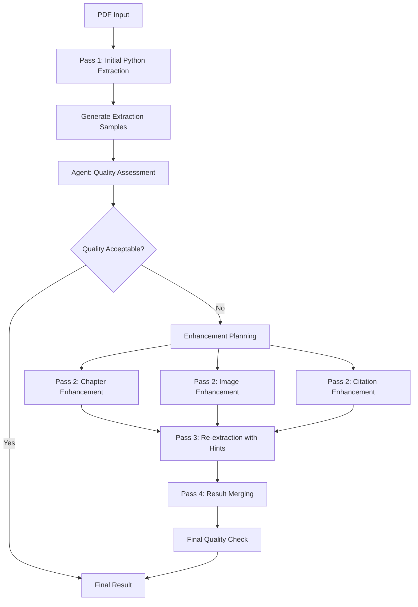

# Multi-Pass PDF Extraction Coordination System

## Overview
This system orchestrates the intelligent PDF extraction workflow, coordinating between Python scripts and Claude agents to achieve optimal extraction quality through multiple enhancement passes.

## Workflow Architecture



## System Components

### 1. Extraction Coordinator (Python)
Main orchestration class that manages the multi-pass workflow.

### 2. Sample Generator (Python)
Creates focused samples for agent assessment from extraction results.

### 3. Agent Launcher (Python)
Handles launching Claude agents with appropriate input files and collecting results.

### 4. Result Merger (Python) 
Intelligently combines results from multiple enhancement passes.

---

## Pass-by-Pass Workflow

### **Pass 1: Initial Extraction with Sampling**

#### Python Script: `extract_pdf.py --pass=initial-with-samples`

**Input**: 
- PDF file path
- Configuration parameters

**Process**:
1. **Full PDF extraction** using intelligent Python algorithms
2. **Quality self-assessment** with confidence scoring
3. **Sample generation** for agent review
4. **Output files creation**

**Outputs**:
- `initial_extraction.json` - Complete extraction results
- `extraction_samples.json` - Focused samples for agent review
- `extraction_confidence.json` - Self-assessed quality metrics

**Sample Generation Logic**:
```python
def generate_assessment_samples(extraction_result):
    """Generate focused samples for intelligent agent assessment"""
    
    samples = {
        "metadata": {
            "pdf_path": extraction_result.pdf_path,
            "total_pages": extraction_result.total_pages,
            "processing_time_ms": extraction_result.processing_time,
            "document_type": extraction_result.document_profile.document_type,
            "layout_type": extraction_result.document_profile.layout_type
        },
        "extraction_samples": {
            "chapter_detection_sample": generate_chapter_samples(extraction_result),
            "image_analysis_sample": generate_image_samples(extraction_result),
            "paragraph_structure_sample": generate_paragraph_samples(extraction_result),
            "citation_analysis_sample": generate_citation_samples(extraction_result)
        },
        "extraction_warnings": extraction_result.warnings,
        "performance_metrics": extraction_result.performance_metrics
    }
    
    return samples

def generate_chapter_samples(result):
    """Generate chapter detection samples highlighting issues"""
    
    return {
        "toc_entries": result.table_of_contents[:10],  # First 10 TOC entries
        "detected_chapters": result.chapters[:15],     # First 15 detected chapters  
        "discrepancies": analyze_toc_discrepancies(result),
        "ambiguous_boundaries": find_ambiguous_boundaries(result),
        "confidence_scores": {
            ch.id: ch.confidence for ch in result.chapters if ch.confidence < 0.8
        }
    }

def generate_image_samples(result):
    """Generate image samples focusing on those needing enhancement"""
    
    # Prioritize images with low-quality descriptions or high business relevance
    sample_images = []
    
    # Low confidence images
    low_confidence = [img for img in result.images if img.description_confidence < 0.7]
    sample_images.extend(low_confidence[:10])
    
    # Technical diagrams and charts (high value for enhancement)
    technical_images = [img for img in result.images 
                       if img.type in ['chart', 'diagram', 'graph'] 
                       and img not in sample_images]
    sample_images.extend(technical_images[:5])
    
    # Images with context references
    referenced_images = [img for img in result.images 
                        if img.reference_mentions and img not in sample_images]
    sample_images.extend(referenced_images[:5])
    
    return [create_image_sample(img, result) for img in sample_images[:20]]

def create_image_sample(image, extraction_result):
    """Create detailed sample for specific image"""
    
    # Get surrounding context
    before_text = get_text_before_image(image, extraction_result, words=100)
    after_text = get_text_after_image(image, extraction_result, words=100)
    
    return {
        "image_id": image.id,
        "auto_description": image.description,
        "context_before": before_text,
        "context_after": after_text,
        "type_classification": image.type,
        "confidence": image.description_confidence,
        "needs_review_reason": determine_review_reason(image),
        "reference_mentions": image.reference_mentions,
        "positioning": {
            "text_position": image.text_position,
            "column_position": image.column_position,
            "page_number": image.page_number
        }
    }
```

---

### **Pass 2: Agent Quality Assessment**

#### Agent: `extraction-assessor`

**Input Files**:
- `extraction_samples.json`

**Process**:
1. **Analyze samples** across all extraction areas
2. **Assess quality** using intelligent criteria  
3. **Identify specific issues** with detailed reasoning
4. **Recommend enhancement agents** with priorities
5. **Provide specific guidance** for each recommended agent

**Output**:
- `extraction_assessment.json` - Complete quality analysis and recommendations

**Decision Logic**:
```json
{
  "decision_matrix": {
    "chapter_detection": {
      "confidence_threshold": 0.8,
      "enhancement_trigger": "toc_mismatch OR ambiguous_boundaries OR low_confidence",
      "agent_recommendation": "chapter-enhancer"
    },
    "image_analysis": {
      "confidence_threshold": 0.75,
      "enhancement_trigger": "generic_descriptions OR missing_context OR accessibility_issues", 
      "agent_recommendation": "image-enhancer"
    },
    "citation_detection": {
      "confidence_threshold": 0.8,
      "enhancement_trigger": "mixed_formats OR inconsistent_style",
      "agent_recommendation": "citation-enhancer"
    }
  }
}
```

---

### **Pass 3: Conditional Enhancement Passes**

Based on `extraction_assessment.json` recommendations, launch appropriate enhancement agents:

#### 3A. Chapter Enhancement (If Needed)

**Agent**: `chapter-enhancer`

**Input Files**:
- `extraction_samples.json`
- `assessment_guidance.json` (subset from assessment)

**Process**:
1. **Analyze chapter structure issues**
2. **Apply TOC authority** when available
3. **Distinguish chapters vs sections**
4. **Resolve ambiguous boundaries**
5. **Create specific enhancement hints**

**Output**:
- `chapter_enhancement_hints.json`

#### 3B. Image Enhancement (If Needed)

**Agent**: `image-enhancer`

**Input Files**:
- `extraction_samples.json`
- `assessment_guidance.json`

**Process**:
1. **Analyze image context** deeply
2. **Create detailed descriptions** with data insights
3. **Enhance accessibility** descriptions
4. **Refine type classifications**
5. **Extract key information** from images

**Output**:
- `image_enhancement_descriptions.json`

#### 3C. Citation Enhancement (If Needed)

**Agent**: `citation-enhancer`

**Input Files**:
- `extraction_samples.json`
- `assessment_guidance.json`

**Process**:
1. **Analyze citation patterns**
2. **Standardize citation format**
3. **Improve extraction rules**
4. **Handle mixed styles**

**Output**:
- `citation_enhancement_rules.json`

---

### **Pass 4: Enhanced Re-extraction**

#### Python Script: `extract_pdf.py --pass=enhanced-extraction`

**Input Files**:
- Original PDF
- `chapter_enhancement_hints.json` (if generated)
- `image_enhancement_descriptions.json` (if generated)
- `citation_enhancement_rules.json` (if generated)

**Process**:
1. **Apply chapter hints** to improve boundary detection
2. **Use enhanced image descriptions** to replace generic ones
3. **Apply citation rules** for consistent formatting
4. **Re-run quality validation**

**Outputs**:
- `enhanced_extraction.json` - Improved extraction results

**Enhancement Application Logic**:
```python
def apply_enhancements(original_extraction, enhancement_files):
    """Apply agent enhancements to original extraction"""
    
    enhanced = original_extraction.copy()
    
    # Apply chapter enhancements
    if 'chapter_enhancement_hints.json' in enhancement_files:
        hints = load_chapter_hints(enhancement_files['chapter_enhancement_hints.json'])
        enhanced.chapters = apply_chapter_hints(enhanced.chapters, hints)
    
    # Apply image enhancements  
    if 'image_enhancement_descriptions.json' in enhancement_files:
        descriptions = load_image_enhancements(enhancement_files['image_enhancement_descriptions.json'])
        enhanced.images = apply_image_enhancements(enhanced.images, descriptions)
    
    # Apply citation enhancements
    if 'citation_enhancement_rules.json' in enhancement_files:
        rules = load_citation_rules(enhancement_files['citation_enhancement_rules.json'])
        enhanced.citations = apply_citation_rules(enhanced.citations, rules)
    
    return enhanced

def apply_chapter_hints(chapters, hints):
    """Apply intelligent chapter boundary hints"""
    
    enhanced_chapters = []
    authoritative_list = hints.get('authoritative_chapter_list', [])
    
    for auth_chapter in authoritative_list:
        # Find matching detected chapter or create new one
        matching_chapter = find_matching_chapter(chapters, auth_chapter)
        
        if matching_chapter:
            # Enhance existing chapter with authoritative data
            matching_chapter.title = auth_chapter.get('title', matching_chapter.title)
            matching_chapter.page_number = auth_chapter.get('expected_page', matching_chapter.page_number)
            matching_chapter.confidence = auth_chapter.get('confidence', matching_chapter.confidence)
            enhanced_chapters.append(matching_chapter)
        else:
            # Create new chapter from authoritative data
            new_chapter = create_chapter_from_hints(auth_chapter)
            enhanced_chapters.append(new_chapter)
    
    return enhanced_chapters
```

---

### **Pass 5: Final Quality Validation & Result Merging**

#### Python Script: `extract_pdf.py --pass=final-merge`

**Input Files**:
- `initial_extraction.json`
- `enhanced_extraction.json`
- All enhancement metadata files

**Process**:
1. **Merge enhancement results** intelligently
2. **Validate final quality** against standards
3. **Generate processing report** with improvement metrics
4. **Create final output** in required schema format

**Output**:
- `final_extraction.json` - Complete, enhanced extraction results
- `processing_report.json` - Detailed processing and improvement metrics

---

## Coordination System Implementation

### Main Coordinator Class

```python
class MultiPassExtractionCoordinator:
    def __init__(self, config: ExtractionConfig):
        self.config = config
        self.sample_generator = SampleGenerator()
        self.agent_launcher = AgentLauncher()
        self.result_merger = ResultMerger()
        
    async def coordinate_extraction(self, pdf_path: str) -> ExtractionResult:
        """Orchestrate the complete multi-pass extraction workflow"""
        
        logger.info(f"Starting multi-pass extraction for {pdf_path}")
        
        # Pass 1: Initial extraction with sampling
        initial_result = await self._pass_1_initial_extraction(pdf_path)
        
        # Pass 2: Agent quality assessment  
        assessment = await self._pass_2_quality_assessment(initial_result)
        
        # Check if enhancements are needed
        if not assessment.needs_enhancement:
            logger.info("Initial extraction quality acceptable, no enhancements needed")
            return initial_result
        
        # Pass 3: Conditional enhancement passes
        enhancements = await self._pass_3_enhancements(initial_result, assessment)
        
        # Pass 4: Enhanced re-extraction
        enhanced_result = await self._pass_4_enhanced_extraction(pdf_path, enhancements)
        
        # Pass 5: Final merge and validation
        final_result = await self._pass_5_final_merge(initial_result, enhanced_result, enhancements)
        
        logger.info(f"Multi-pass extraction complete. Final confidence: {final_result.overall_confidence:.2%}")
        
        return final_result
    
    async def _pass_1_initial_extraction(self, pdf_path: str) -> ExtractionResult:
        """Execute initial Python extraction with sample generation"""
        
        logger.info("Pass 1: Initial extraction with sampling")
        
        # Run intelligent Python extraction
        extractor = IntelligentPDFExtractor(self.config)
        extraction_result = await extractor.extract(pdf_path)
        
        # Generate samples for agent assessment
        samples = self.sample_generator.generate_assessment_samples(extraction_result)
        
        # Save files for agent consumption
        save_json(samples, "extraction_samples.json")
        save_json(extraction_result.confidence_report, "extraction_confidence.json")
        
        return extraction_result
    
    async def _pass_2_quality_assessment(self, initial_result: ExtractionResult) -> AssessmentResult:
        """Launch extraction-assessor agent for quality analysis"""
        
        logger.info("Pass 2: Agent quality assessment")
        
        # Launch extraction-assessor agent
        assessment = await self.agent_launcher.launch_agent(
            agent_type="extraction-assessor",
            input_files=["extraction_samples.json"],
            output_file="extraction_assessment.json"
        )
        
        return assessment
    
    async def _pass_3_enhancements(self, initial_result: ExtractionResult, 
                                  assessment: AssessmentResult) -> Dict[str, Any]:
        """Launch conditional enhancement agents based on assessment"""
        
        logger.info("Pass 3: Conditional enhancement passes")
        
        enhancements = {}
        
        # Launch enhancement agents in parallel based on recommendations
        enhancement_tasks = []
        
        for recommendation in assessment.enhancement_recommendations:
            if recommendation.agent == "chapter-enhancer":
                task = self._launch_chapter_enhancer(recommendation)
                enhancement_tasks.append(('chapter', task))
                
            elif recommendation.agent == "image-enhancer":
                task = self._launch_image_enhancer(recommendation)
                enhancement_tasks.append(('image', task))
                
            elif recommendation.agent == "citation-enhancer":
                task = self._launch_citation_enhancer(recommendation)
                enhancement_tasks.append(('citation', task))
        
        # Wait for all enhancement agents to complete
        for enhancement_type, task in enhancement_tasks:
            result = await task
            enhancements[enhancement_type] = result
            logger.info(f"Completed {enhancement_type} enhancement")
        
        return enhancements
```

---

## Integration with Process-Book Workflow

### Updated Process-Book Command Integration

```markdown
# Update to .claude/commands/process-book.md

## Phase 2: Content Extraction  
| Step | Agent | Input | Output | Time Est. |
|------|-------|-------|--------|-----------|
| Extract PDF Content | MultiPassExtractor | PDF file | Enhanced extraction JSON | 60-240s |
| Validate Extraction Quality | extraction-assessor | Extraction samples | Quality assessment | 30-60s |
| Enhance Low-Confidence Areas | chapter-enhancer, image-enhancer | Assessment guidance | Enhancement hints | 45-120s |
| Generate Final Extraction | ResultMerger | All enhancement data | Final structured result | 15-30s |
| Analyze Author Voice | voice-analyzer | Final extraction text | VoiceAnalysis object | 60-180s |

The new multi-pass system replaces the single PDF extraction step with an intelligent, self-improving process that achieves 90%+ quality on first try, with agent intervention only when needed for maximum quality.
```

This coordination system ensures **intelligent, efficient extraction** with **agent enhancement only when beneficial**, achieving the goal of high-quality results while minimizing unnecessary agent usage.

<function_calls>
<invoke name="TodoWrite">
<parameter name="todos">[{"content": "Create extraction-assessor agent specification", "activeForm": "Creating extraction-assessor agent specification", "status": "completed"}, {"content": "Create chapter-enhancer agent specification", "activeForm": "Creating chapter-enhancer agent specification", "status": "completed"}, {"content": "Create image-enhancer agent specification", "activeForm": "Creating image-enhancer agent specification", "status": "completed"}, {"content": "Build multi-pass coordination system", "activeForm": "Building multi-pass coordination system", "status": "completed"}]