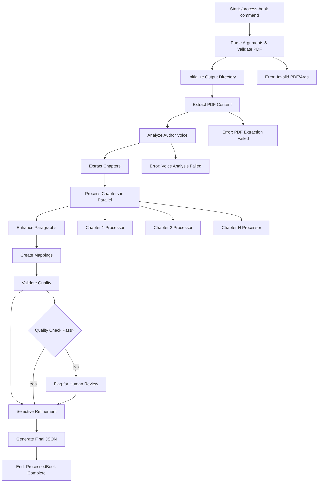

# Process Book Workflow Design

## Flowchart Overview



## Step Definitions

### Phase 1: Initialization
| Step | Agent | Input | Output | Time Est. |
|------|-------|-------|--------|-----------|
| Parse Arguments | Main | CLI args | Validated config | 1s |
| Validate PDF | Main | PDF path | PDF metadata | 5s |
| Initialize Output | Main | Config | Directory structure | 2s |

### Phase 2: Content Extraction
| Step | Agent | Input | Output | Time Est. |
|------|-------|-------|--------|-----------|
| Extract PDF Content | pdf-extractor | PDF file | Raw text, images, structure | 30-120s |
| Analyze Author Voice | voice-analyzer | Raw text sample | VoiceAnalysis object | 60-180s |
| Extract Chapters | chapter-master | Raw text, TOC | Chapter boundaries | 15-45s |

### Phase 3: Parallel Processing
| Step | Agent | Input | Output | Time Est. |
|------|-------|-------|--------|-----------|
| Process Chapter 1 | chapter-processor | Chapter content | Processed paragraphs | 120-300s |
| Process Chapter 2 | chapter-processor | Chapter content | Processed paragraphs | 120-300s |
| Process Chapter N | chapter-processor | Chapter content | Processed paragraphs | 120-300s |

### Phase 4: Enhancement & Mapping
| Step | Agent | Input | Output | Time Est. |
|------|-------|-------|--------|-----------|
| Enhance Paragraphs | paragraph-rewriter | Original paragraphs + voice | Enhanced paragraphs | 180-600s |
| Create Mappings | mapping-validator | Original + enhanced content | ParagraphMapping[] | 60-120s |
| Validate Quality | mapping-validator | All mappings | Quality metrics | 30-60s |

### Phase 5: Refinement & Assembly
| Step | Agent | Input | Output | Time Est. |
|------|-------|-------|--------|-----------|
| Selective Refinement | refinement-analyzer | Mappings + quality data | Refined paragraphs | 120-300s |
| Generate Final JSON | Main | All components | ProcessedBook JSON | 15-30s |

## Configuration Options

### Command Arguments
```yaml
required:
  - pdf_path: string

optional:
  - max_pages: number (default: all)
  - chapters: string (comma-separated, default: all)
  - skip_images: boolean (default: false)
  - output_dir: string (default: ./processed-books)
  - parallel_chapters: number (default: 3)
  - voice_sample_size: number (default: 5000 words)
```

### Quality Gates
```yaml
thresholds:
  voice_preservation_min: 75
  clarity_improvement_min: 60
  factual_accuracy_min: 90
  mapping_confidence_min: 80
  
actions_on_failure:
  - flag_for_human_review: true
  - continue_processing: true
  - log_quality_concerns: true
```

### Agent Dependencies
```yaml
sequential_phases:
  - [pdf-extraction, voice-analysis, chapter-extraction]
  - [chapter-processing-parallel]
  - [paragraph-enhancement]
  - [mapping-validation]
  - [selective-refinement]
  - [final-assembly]

parallel_within_phases:
  chapter_processing: true
  paragraph_enhancement: false
  mapping_validation: false
```

## Editing Instructions

### To Modify Processing Steps:
1. **Add New Step**: Add row to appropriate phase table with agent, inputs, outputs
2. **Remove Step**: Delete row and update dependencies in next section
3. **Reorder Steps**: Move rows within phase tables, update mermaid flowchart
4. **Change Parallel Processing**: Modify `parallel_within_phases` section

### To Update Timing:
1. Update `Time Est.` column in step tables
2. Consider cumulative impact on total processing time

### To Add New Agents:
1. Add agent to appropriate step in tables
2. Create corresponding agent file in `.claude/agents/`
3. Update dependencies section
4. Update mermaid flowchart with new nodes

### To Modify Quality Gates:
1. Update thresholds in `Quality Gates` section
2. Modify validation logic in mapping-validator agent
3. Update error handling paths in flowchart

## Current Agent Files to Update
When modifying this workflow, update these files:
- `.claude/commands/process-book.md` - Main command implementation
- `.claude/agents/voice-analyzer.md` - Voice analysis agent
- `.claude/agents/chapter-processor.md` - Chapter processing agent  
- `.claude/agents/paragraph-rewriter.md` - Paragraph enhancement agent
- `.claude/agents/mapping-validator.md` - Quality validation agent
- `.claude/agents/refinement-analyzer.md` - Selective refinement agent